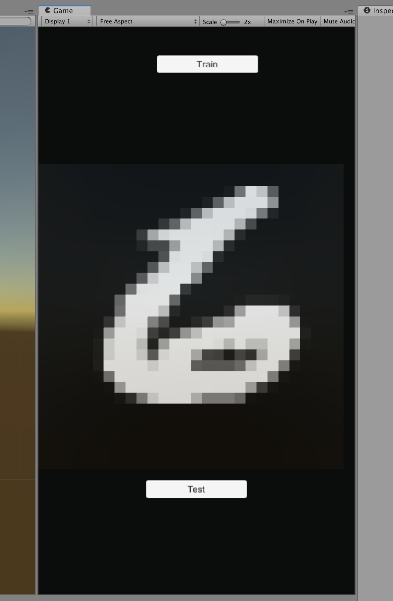

# Neural Network (Back-Propagation) in Unity 3D

> Unity version: 2018.3.0f2

Neural network in Unity 3D trained with Back-Propagation, to recognize handwritten digits from the [MNIST](http://yann.lecun.com/exdb/mnist/) data set.

## Implementación
The neural network implementation was done by following this very good tutorial [Neural Network - Back-Propagation Tutorial In C#](https://www.youtube.com/watch?v=L_PByyJ9g-I&t=2428s).

## Other resources
* [3Blue1Brown Neural Network series](https://www.youtube.com/watch?v=aircAruvnKk)
* [Distill](https://distill.pub/)
* [Michael Nielsen book, introducing neural networks and deep learning](http://neuralnetworksanddeeplearning.com/)

## Future work
* Save the model in a binary file.
* Drawing tool for testing with your own digits drawings.
